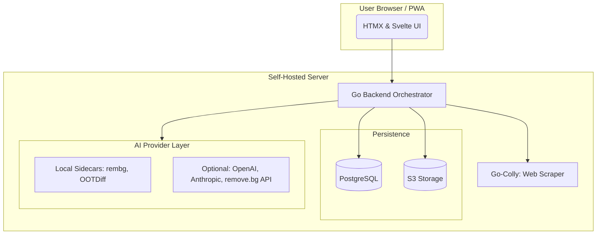

# PRD: go-threads

## 1. Project Vision
**go-threads** is a privacy-first, self-hosted digital wardrobe manager. It bridges the gap between manual inventory tracking and high-end AI styling. By running locally, it enables features like **Virtual Try-On** and **Automated Scraping** without sending private photos or shopping habits to the cloud.

## 2. Reference & Inspiration
The feature set is inspired by the best-in-class features of existing mobile apps and community feedback:
* **Reddit r/selfhosted Context:** [Is there a Self-Hostable Wardrobe Manager?](https://www.reddit.com/r/selfhosted/comments/1qqioxu/comment/o3j4nxk/?context=1) - Baseline for community needs (cost-per-wear, laundry tracking).
* **Stylebook:** The "OG" of the space. Key features to replicate: Calendar planning, "Cost-per-Wear" statistics, and the ability to track "Worn History."
* **Whering:** Inspiration for the AI "Dress Me" shuffle mode and seamless web-scraping for new items.
* **Twelve70:** Inspiration for "Weather-based" suggestions and a simplified menswear-first UI option.
* **Acloset:** Benchmark for AI background removal and "professional-looking" item catalogs from messy snapshots.

---

## 3. Tech Stack
* **Backend:** Go (Golang)
* **Database:** PostgreSQL (Metadata, Logs, Scraped Data)
* **Storage:** S3-Compatible Object Storage (SeaweedFS, RustFS, or MinIO)
* **Frontend:** HTMX + Templ (Core) | Svelte (Outfit Canvas & Try-On Tool)
* **Deployment:** Docker Compose & Nix Flakes (NixOS Modules)

---

## 4. System Architecture
The Go backend coordinates requests between the S3 storage, the Postgres DB, and AI workers.

---

## 5. Functional Requirements

### 5.1 Local-First AI Strategy (Hard Requirement)
* **Privacy Baseline:** By default, all AI operations (BG removal, tagging, try-on) must run via local sidecar containers.
* **Hybrid Configuration:** Users must be able to configure `AI_PROVIDER` via environment variables or a YAML config to swap local models for cloud APIs (e.g., swapping a local `rembg` container for the `remove.bg` API).
* **Virtual Try-On (VTO):** Integrate with a local **OOTDiffusion** or **Stable Diffusion** instance.

### 5.2 The "Grabber" (Web Scraper)
* **Auto-Digitization:** Users paste a product URL (e.g., Uniqlo, Zara, SSENSE).
* **Data Extraction:** The backend uses `go-colly` to scrape high-res product images, price, and brand.
* **AI Pipeline:** Scraped images must automatically pass through the background removal pipeline before S3 storage.

### 5.3 Inventory & Laundry Logic
* **Wear Tracking:** Increment `wear_count` automatically when an outfit is logged to the calendar.
* **Laundry Logic:** Visual alerts when an item reaches its `max_wears` threshold.
* **Cost-per-Wear Stats:** A dashboard showing which items are your "best investments" vs. "least worn."

### 5.4 Outfit Studio & Multi-Rating System
* **Visual Studio (Svelte):** High-interactivity canvas to drag, resize, and layer items to build looks.
* **The 3-Tier Rating System:**
    1. **Personal:** (1-5 stars) "How I felt."
    2. **Spouse/Partner:** (1-5 stars) "Feedback from spouse."
    3. **Social:** (1-5 stars) "Feedback from friends/public."

---

## 6. Data Schema (Postgres Highlights)

### `items`
* `id` (UUID), `name`, `price`, `source_url`, `s3_key_raw`, `s3_key_clean`, `wear_count`, `max_wears`.

### `outfits`
* `id` (UUID), `item_ids` (UUID Array), `ratings` (JSONB), `vto_preview_key` (S3 Key).

---

## 7. Deployment & Nix
The project must include a `flake.nix` providing a DevShell (Go, PostgreSQL, MinIO) and a NixOS Module to enable the service declaratively.
